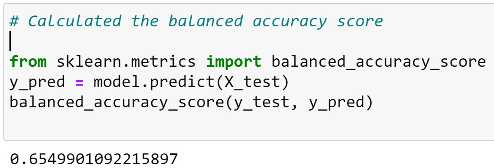
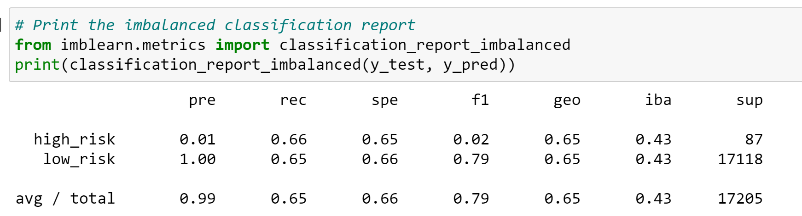
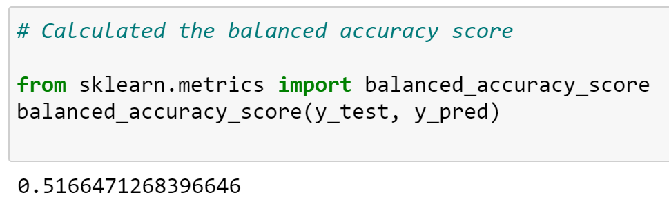
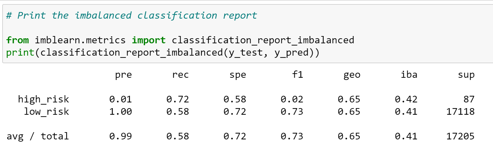
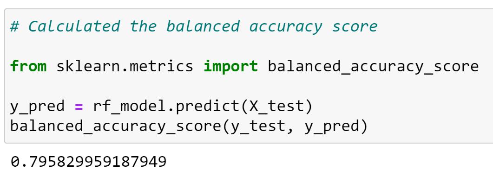
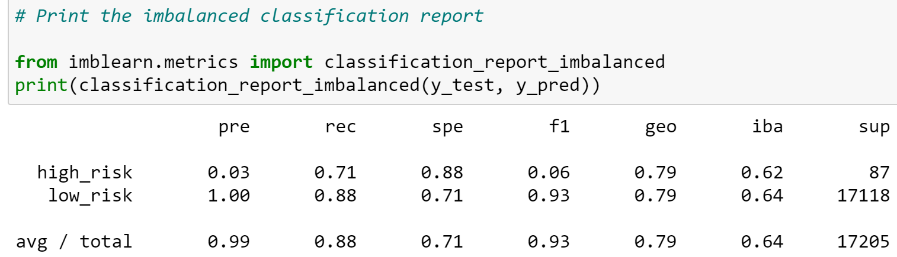
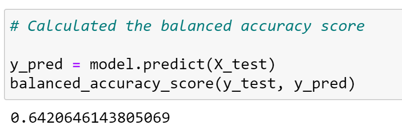
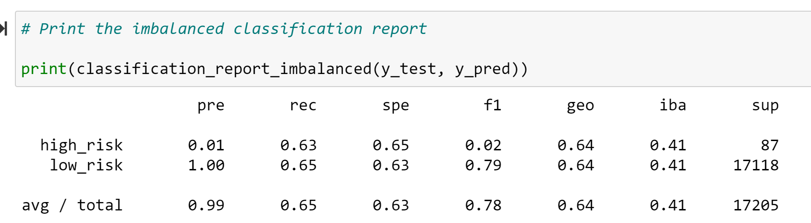
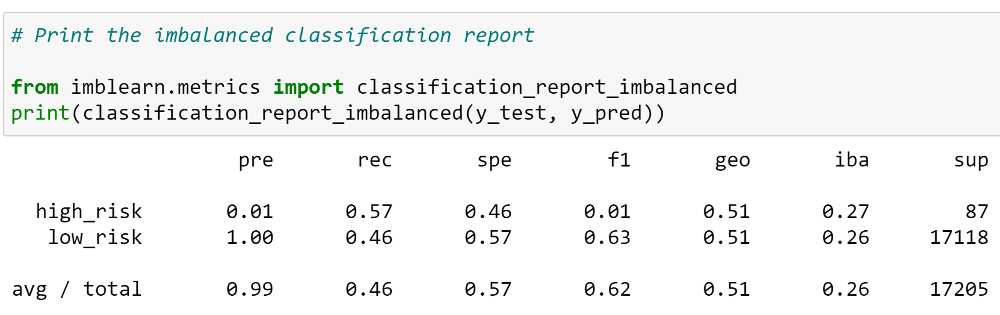

# Module 17 Challenge - Credit Risk Analysis

## Overview of the Analysis

The purpose of the analysis is to use 
different machine learning models to predict credit risk for FinTech (financial technology) firms. The credit card credit dataset contains data from 2019 Q1 and is provided by LendingClub.

## Results

### Random Sampling

The balanced accuracy score is 65%.  The imbalanced classification report shows high-risk precision at 1% with recall (sensitivity) with f1 at 2%. The low-risk class number is high giving it a 100% precision and recall of 65%.

### COMBO - Over and Under Sampling

The balanced accuracy score is 52% (rounded).  The imbalanced classification report shows high-risk precision at 1% with recall (sensitivity) with f1 at 2%. Similar to Random Sampling. The low-risk class number is high giving it a 100% precision and recall of 58%.

### Ensemble/Random Forest

The balanced accuracy score is 79%. The highest of all the models. The imbalanced classification report shows high-risk precision at 3% with recall (sensitivity) with f1 at 71%. The low-risk class number is high giving it a 100% precision and recall of 88%.

### SMOTE

Similar to Random Sampling, the balanced accuracy score is 64%.  The imbalanced classification report shows high-risk precision at 1% with recall (sensitivity) with f1 at 2%. The low-risk class number is high giving it a 100% precision and recall of 65%.

### Undersampling

The balanced accuracy score is also 64%. The imbalanced classification report shows high-risk precision at 1% with recall (sensitivity) with f1 at 1%. The low-risk class number is high giving it a 100% precision and recall of 63%.

### AdaBoost

The balanced accuracy score similar to Undersampling, SMOTE and Random Sampling is also 64% with . The imbalanced classification report shows high-risk precision at 1% with recall (sensitivity) with f1 at 1%. The low-risk class number is high giving it a 100% precision and recall of 63%.

## Summary

Most of the models are preferred since the precision score for high-risk at 0.01. Models AdaBoost, Undersampling, SMOTE had the same accuracy score at 64%, Random slightly higher at 65% and OverSampling the lowest at 51%. It's possible to use the  Ensemble/Random Forest which was highest at 79% with recall/sensitivity at 71% for high-risk and 88% for low-risk. Precision for high-risk was 3% vs low-risk at 100%. Overall the models have low precision. 

